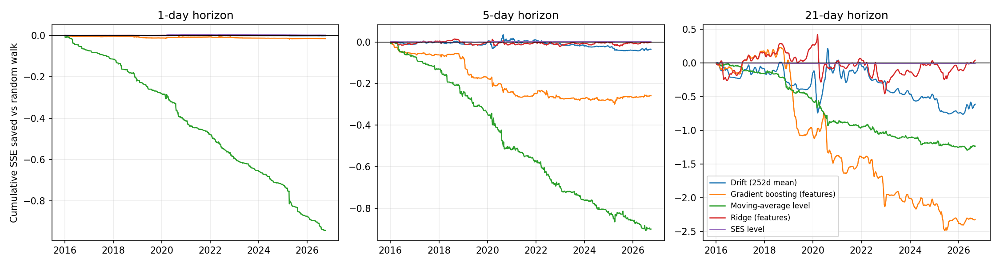
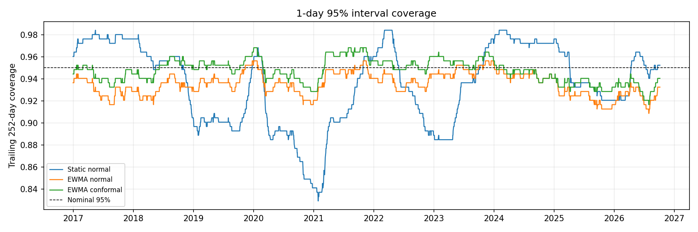
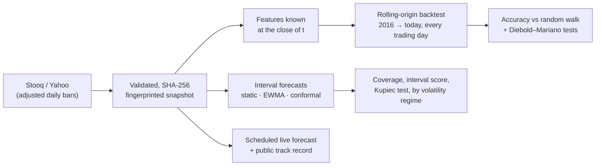

# AAPL Forecasting — Rolling-Origin Backtest and Live Interval Forecasts

[](https://github.com/dbechrakis/aapl-stock-exploratory-analysis/actions/workflows/evidence.yml)

A forecasting study that answers two separate questions honestly. The results are below.

1. **Can any model beat the random walk at forecasting AAPL's 1-, 5- and 21-day returns?** If it does, is the gain statistically significant?
2. **Can the *size* of the next move be forecast**, so the intervals hold their stated coverage in both calm and volatile markets?

The two questions are kept apart because they usually have different answers. Direction is close to unpredictable for a liquid large-cap stock. Volatility clusters, so uncertainty can be forecast.

**Stack:** Python · pandas · NumPy · SciPy · scikit-learn · Matplotlib · GitHub Actions

## Results (AAPL, 2,705 daily origins, Jan 2016 – Oct 2026)

Snapshot: Yahoo split- and dividend-adjusted daily bars, 2010-01-04 to 2026-10-07. It has 4,216 rows and SHA-256 `c9c5e42c…` (see [`data/manifest.json`](data/manifest.json)). It was produced by the [`Refresh backtest`](.github/workflows/refresh-backtest.yml) workflow on 2026-10-08.

### 1. Nothing beats the random walk, and the most flexible model is significantly worse

| Model | MAE vs RW, 1d | 5d | 21d | Significantly different from RW? (DM, squared error) |
|---|---:|---:|---:|---|
| Ridge (13 features) | 0.998 | 0.993 | **0.965** | No at any horizon (p ≥ 0.45) |
| Drift (252-day mean) | 1.001 | 0.992 | 0.999 | No (p ≥ 0.49) |
| SES level | 1.000 | 1.001 | 1.001 | No (p ≥ 0.31) |
| Gradient boosting (13 features) | 1.013 | 1.032 | 1.039 | **Worse** at 5d (p = 0.001) and 21d (p = 0.021) |
| Moving-average level | 1.547 | 1.137 | 1.040 | **Worse** at every horizon (p < 0.001) |



- **Ridge's 3.5% lower 21-day MAE is not evidence of skill.** The Diebold–Mariano test cannot separate it from the random walk (p = 0.11 on absolute error, p = 0.96 on squared error). The cumulative plot shows the advantage repeatedly appearing and vanishing.
- **Gradient boosting fits noise.** Its losses pile up after the 2019–2020 regime changes. That is the expected failure mode of a flexible learner on a near-unpredictable target.
- **Direction:** no model's hit rate beats the trivial "always up" rate for the same period (53.6% at 1d, 58.5% at 5d, 64.4% at 21d). The best is Ridge at 61.3% for 21 days.
- The tuning of the coursework smoothers itself points to the random walk. On the pre-2016 burn-in, SES chose α = 0.95 and the moving average chose its shortest window (5 days).

### 2. The size of the next move *is* forecastable

| 1-day interval | Coverage at 80% | at 95% | 95% in high volatility | 95% in low volatility | Kupiec p (95%) |
|---|---:|---:|---:|---:|---:|
| Static normal | 83.7% | 93.6% | 90.7% | 97.0% | 0.002 |
| EWMA normal | 82.8% | 93.6% | 94.5% | 92.5% | 0.001 |
| **EWMA conformal** | **80.3%** | **94.7%** | **96.2%** | **93.0%** | **0.50** |



- **Only the conformal interval passes the coverage test.** Kupiec p = 0.74 at 80% and 0.50 at 95%. The static and EWMA-normal intervals are rejected at both levels.
- **A constant-width interval fails when it matters.** It covers 90.7% instead of 95% in volatile periods, and its trailing-year coverage fell to 83% in early 2021. It over-covers in calm periods.
- **At 21 days the picture changes.** Conformal coverage is right on average (79.1% / 95.1%) but uneven by regime: 87.4% in high-volatility periods and 69.4% in low-volatility periods at the 80% level. The static interval has the better interval score at 21 days (both levels) and at 5 days for 95%. Volatility mean-reverts over a month, and scaling today's EWMA volatility by √h ignores that. A volatility model with mean reversion (e.g. GARCH) is the natural next step for longer horizons.

Full tables: [`accuracy.csv`](outputs/backtest/accuracy.csv) · [`interval_calibration.csv`](outputs/backtest/interval_calibration.csv) · [all forecasts](outputs/backtest/predictions.csv.gz) · [run manifest](outputs/backtest/run_manifest.json).

## Design



### Point forecasts of h-day log returns (h = 1, 5, 21)

| Model | What it forecasts | Fitted on |
|---|---|---|
| Random walk | zero return (benchmark) | — |
| Drift | trailing 252-day mean return × h | expanding history |
| SES level / moving-average level | mean reversion towards a smoothed price, from the original coursework | α and window tuned once, on the pre-2016 burn-in |
| Ridge | 13 features: momentum, realised and EWMA volatility, 52-week-high distance, range, volume z-score, weekday | refitted every 21 trading days |
| Gradient boosting | the same 13 features, shallow trees | refitted every 21 trading days |

### Leakage rules (each one is tested)

- Every feature at origin *t* uses prices and volume up to the close of *t* only.
- At a refit on day *t*, a training row *j* is used only if its label had matured, meaning *j + h ≤ t*. Overlapping multi-day labels therefore never reach past the origin.
- Smoother hyperparameters are tuned once, on targets that matured before the first origin.
- Conformal intervals at *t* use only standardized outcomes that had matured by *t*.
- **Test:** perturbing every price after day *t* must leave features, point forecasts, tuning and interval bounds at or before *t* bit-identical. Deliberately reintroducing either leak makes the test fail; this was checked by mutation.

### Evaluation

- **Accuracy:** MAE and RMSE as ratios to the random walk (below 1 beats it).
- **Significance:** Diebold–Mariano with the Harvey–Leybourne–Newbold small-sample correction. A long-run variance up to lag *h − 1* accounts for overlapping multi-day errors.
- **Direction:** hit rate, compared with the trivial "always up" rate over the same period. A directional claim must beat that rate, not 50%.
- **Intervals at 80% and 95%:**
  - Three methods are compared, all centred on the random walk: static normal, EWMA normal (RiskMetrics λ = 0.94), and EWMA-scaled split-conformal (empirical quantiles of the last 1,000 matured standardized outcomes).
  - Each is scored on coverage overall and in the high- and low-volatility halves, on mean width and on the Winkler interval score.
  - Kupiec's proportion-of-failures test is reported at h = 1, the only horizon where outcomes are independent.

## Live forecasting in production

[`live-forecast.yml`](.github/workflows/live-forecast.yml) runs after every US close:

1. Downloads a fresh snapshot.
2. Issues 1-, 5- and 21-day conformal intervals at 80% and 95%.
3. Scores every earlier forecast whose horizon has passed.
4. Commits the result to [`outputs/live/forecast_log.csv`](outputs/live/) and [`track_record.csv`](outputs/live/).

The bounds are stored in log-return space and scored with close-to-close ratios. A later dividend re-adjustment of the price history therefore cannot change a past score; a test covers this. The log is append-only and timestamped. Over time it becomes an out-of-sample record that no backtest can be tuned to.

## Synthetic sanity check

The test suite also runs the pipeline on simulated GARCH(1,1) prices, where the right answer is known: direction is unpredictable and volatility clusters. As expected, no model beats the random walk there and the conformal interval is calibrated. This checks the method; it says nothing about AAPL.

## Run locally

```bash
python -m venv .venv && source .venv/bin/activate
python -m pip install -r requirements.txt
make check        # lint + evidence + 22 tests (~5 s)
make data         # download and fingerprint the snapshot (Yahoo, with Stooq as fallback)
make backtest     # ~2 min; writes outputs/backtest/
make forecast     # issue and score live forecasts
```

## Repository structure

```text
src/aapl_forecast/
├── data.py          # Download (Stooq → Yahoo fallback), validation, fingerprinting
├── features.py      # Features known at the close; h-day targets
├── backtest.py      # Rolling-origin backtest with matured-label refits
├── evaluation.py    # Accuracy vs random walk, Diebold–Mariano
└── intervals.py     # Static / EWMA / conformal intervals, coverage, Kupiec
scripts/             # download_data, run_backtest, forecast_latest
tests/               # look-ahead, statistics, validation and live-scoring tests
coursework/          # Original January-window coursework experiment (archived)
.github/workflows/   # CI, manual backtest refresh, scheduled live forecast
```

## Original coursework (archived)

The project began as an MSc coursework experiment. It trained on January only and forecast February–December price levels for 2023 and 2024, using naive, moving-average, SES and trend-seasonal methods. That code now sits in [`coursework/`](coursework/), with its corrected tuning rules still under test.

Its historical score table stays withdrawn: the original source CSV was never committed, so it cannot be reproduced. The rolling-origin study replaces that design, which had one training window per year and a single long horizon. The report and presentation are archived coursework artifacts. The original report credits Nikitas Valtadoros, David Frederick and Dimitrios Bechrakis.

## Limitations

- Prices come from a free provider's adjusted series (Yahoo; Stooq now serves a browser challenge to scripts). Adjustment conventions differ between providers, so the snapshot fingerprint matters more than the source name.
- One asset only. A positive finding on AAPL would still need testing on other tickers before it could be called general.
- No transaction costs or trading rules. This is forecast evaluation, not a strategy backtest.
- Learned models are refitted every 21 trading days, not daily, to keep compute small.

## Author

**Dimitris Bechrakis** — MSc Data Science, The American College of Greece.

## Licensing

See [licensing scope](LICENSING.md) for the MIT-licensed code and the separately governed coursework materials.
